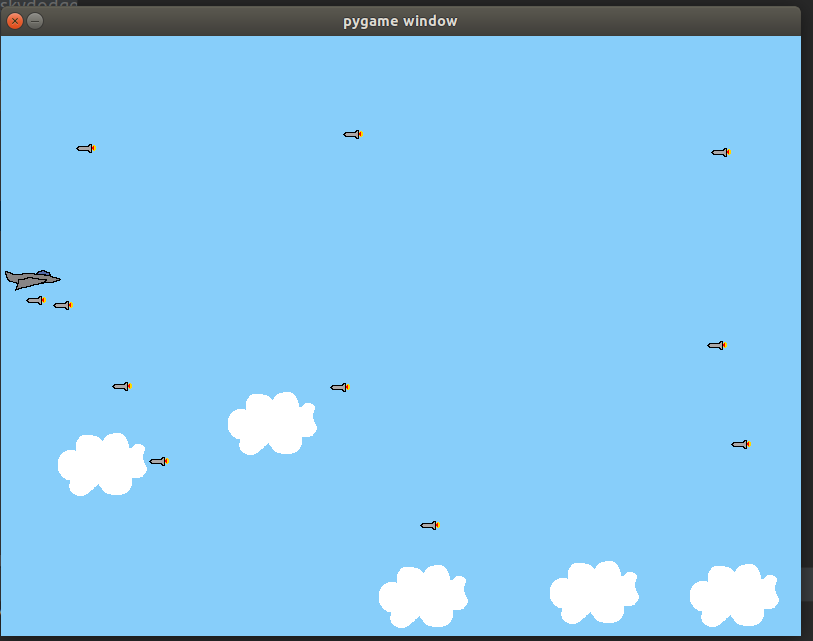

Free resource for the games:

* OpenGameArt.org: sounds, sound effects, sprites, and other artwork
* Kenney.nl: sounds, sound effects, sprites, and other artwork
* Gamer Art 2D: sprites and other artwork
* CC Mixter: sounds and sound effects
* Freesound: sounds and sound effects

## Images
| [SkyDodge](https://github.com/belushkin) | [Certificate](https://realpython.com/certificates/7a38bfd2-88fd-4620-a6e1-5c3dbe728160/) |
| :---: | :---: |
|  |  |